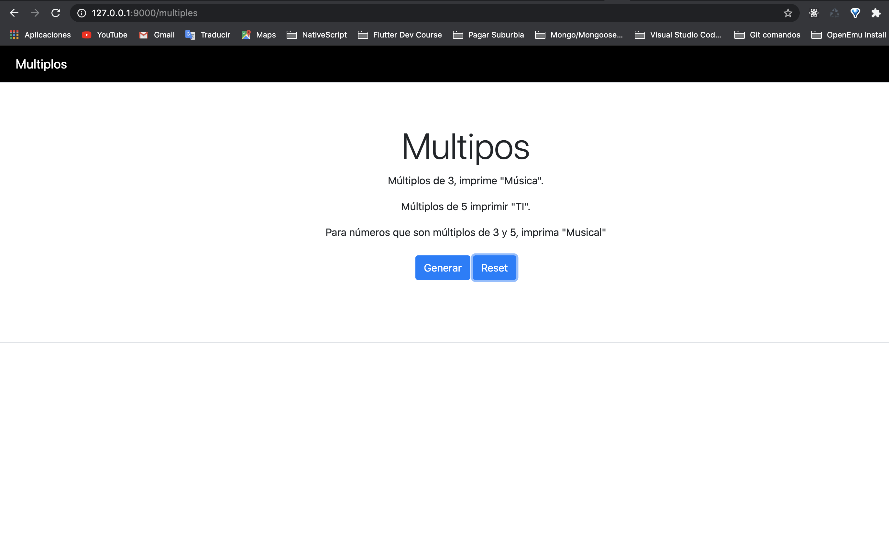

# Multiplos de 3 y 5

## Desafío Desarrollador Backend

## Descripción

Programa que imprime todos los números del 1 al 100.
Múltiplos de 3, en lugar de que muestre el número, que imprima "Música". 

Para los múltiplos de 5 imprimir "TI". 

Para los números que son múltiplos de 3 y 5, imprimir "Musical".

### Nota:
El truco es: solo se puede usar solo un `if`. No hay múltiples ramas, ternario
operadores o `else`.

## Requisitos
* Solo un `if`.
* No puede usar `else`,` else if` o ternario.
* Pruebas unitarias.
* Aplicar su conocimiento SOLID.

### Nota Personal:
* Escribi el desafío NodeJS, Javascript y TypeScript.

## Ejecución

Instalación de paquetes:

**npm i**

Ejecutar el proyecto

***npm run dev***

Hacer click para abrir la pagina

http://127.0.0.1:9000

## Pantalla

